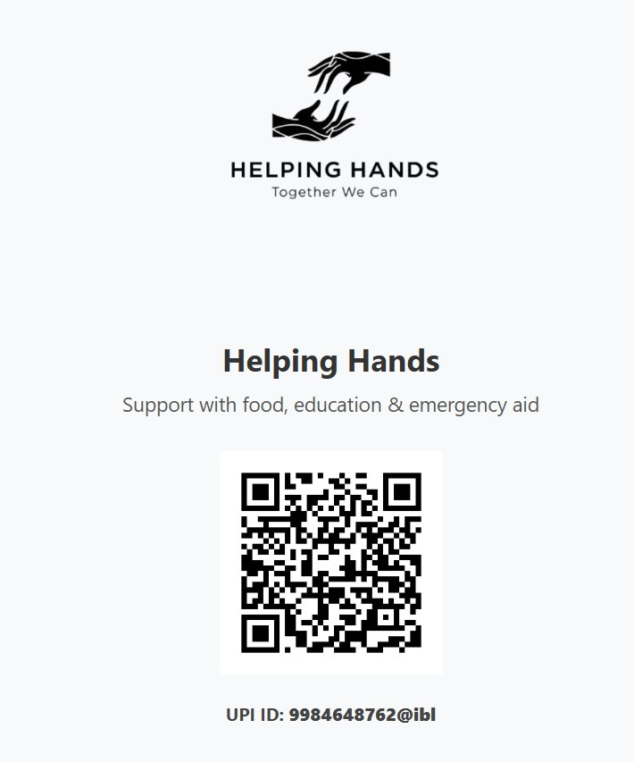
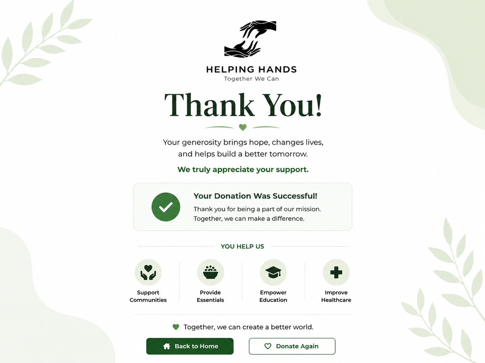

# 🤝 HelpingHands Donation

A community-driven donation platform designed to connect donors with meaningful causes and support initiatives through a simple, accessible and user-friendly experience.

🌍 **Live Demo**
https://abhishek0290.github.io/helping-hands-donation/

---

## 🚀 Features

* Donation-focused platform
* Clean and responsive user interface
* QR-based donation support
* Thank-you page workflow
* Mobile-friendly design
* Community-driven approach
* Deployed using GitHub Pages

---

## 📸 Screenshots

### Home Page

### Donation Section

### Thank You Page

---

## 🛠 Tech Stack

### Frontend

* HTML5
* CSS3
* JavaScript

### Deployment

* GitHub Pages

---

## 📌 Project Overview

HelpingHands Donation was built to simplify the donation process and encourage community participation through a clean and accessible digital platform.

The project focuses on usability, accessibility and creating a seamless donation experience for users.

---

## 🌟 Objectives

* Promote social impact through technology
* Make donation experiences simple and accessible
* Encourage community engagement
* Provide a responsive user experience across devices

---

## 📈 Future Enhancements

* Secure payment gateway integration
* User authentication and profiles
* Donation tracking dashboard
* NGO and campaign management
* Real-time donation analytics

---

## 👨‍💻 Author

### Abhishek Dwivedi

🌐 Portfolio
https://abhishekdwivedi-portfolio.vercel.app

💼 LinkedIn
https://www.linkedin.com/in/abhishekdwivedi29/

📧 Email
[abhishekdwi455@gmail.com](mailto:abhishekdwi455@gmail.com)

---

⭐ Built with the goal of making community support and donations more accessible through technology.

